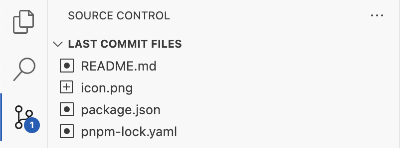

# git-commit-peek

## Overview

**Git Commit Peek** is a Visual Studio Code extension that shows the files changed in the last commit of your current Git repository. It provides a fast and simple way to quickly view the most recent changes directly within the VS Code Source Control view.

## How It Works

After installing the extension, a new view called **Last Commit Files** appears in the Source Control (SCM) sidebar. This view automatically lists all files that were changed in the latest commit of the active repository. Selecting a file allows you to peek at its changes or open it for review.

No configuration is required. The extension works out-of-the-box for any folder opened in VS Code that is a Git repository.

## Features

- View a list of files changed in the last commit
- Quickly open or peek at changed files
- Integrates with the Source Control sidebar for easy access

## Requirements

No special requirements. Works with any Git repository opened in VS Code.

## Extension Settings

This extension does not contribute any custom settings.

## Known Issues

No known issues at this time.
